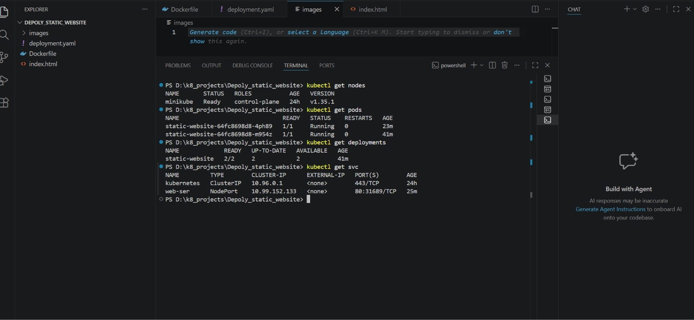
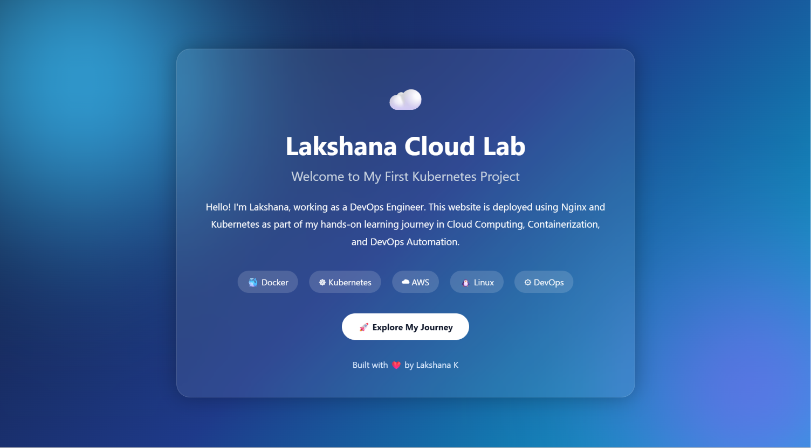
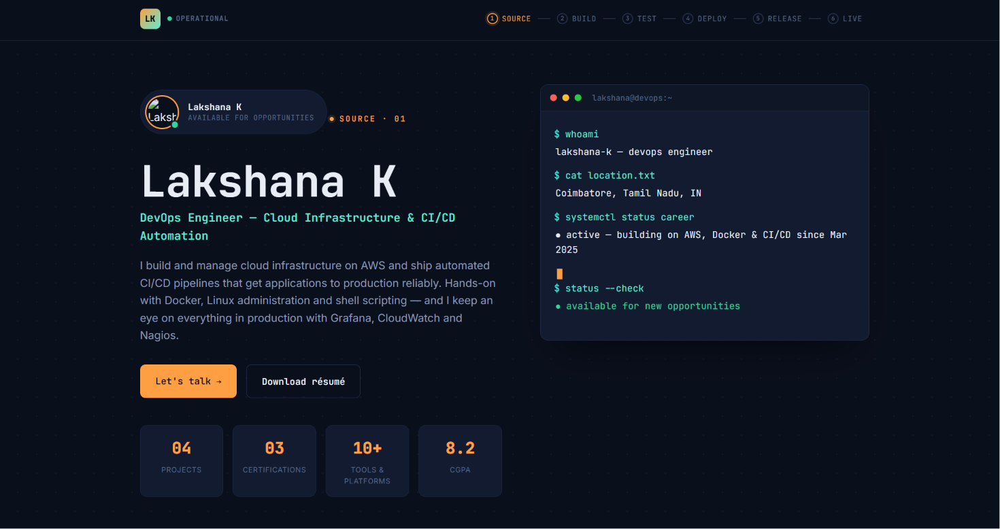

<div align="center">

# 🚀 Kubernetes Static Website Deployment

### Containerized with Docker · Orchestrated with Kubernetes · Run locally on Minikube

[](https://www.docker.com/)
[](https://kubernetes.io/)
[](https://minikube.sigs.k8s.io/)
[](https://nginx.org/)

</div>

---

## 📖 Overview

This project demonstrates how to containerize a static HTML website using **Docker** and **Nginx**, then deploy and manage it on a **Kubernetes** cluster running locally via **Minikube**. It covers the full deployment lifecycle — from building the image to rolling updates, rollbacks, and scaling.

---

## 🛠️ Tech Stack

| Tool | Purpose |
|------|---------|
| **Docker** | Containerize the static website |
| **Nginx** | Serve the static HTML content |
| **Kubernetes** | Orchestrate and manage containers |
| **Minikube** | Run a local Kubernetes cluster |
| **kubectl** | CLI to interact with the cluster |

---

## 📁 Project Structure

```text
Deploy_static_website/
│
├── Dockerfile
├── index.html
├── deployment.yaml
├── README.md
└── images/
    ├── deployment-running.png
    └── website-output.png
```

---

## ✅ Prerequisites

- [Docker Desktop](https://www.docker.com/products/docker-desktop/)
- [Minikube](https://minikube.sigs.k8s.io/docs/start/)
- [kubectl](https://kubernetes.io/docs/tasks/tools/)
- [Git](https://git-scm.com/)

---

## 📦 Kubernetes Resources

### Deployment

| Property | Value |
|---|---|
| Name | `static-website` |
| Replicas | `2` |
| Container Image | `lakshana-web:v1` |
| Container Port | `80` |

### Service

| Property | Value |
|---|---|
| Name | `web-ser` |
| Type | `NodePort` |
| Port | `80` |

---

## 🚦 Deployment Steps

### 1️⃣ Build the Docker Image
```bash
docker build -t lakshana-web:v1 .
```
Verify the image was created:
```bash
docker images
```

### 2️⃣ Load the Image into Minikube
```bash
minikube image load lakshana-web:v1
```
Verify it loaded successfully:
```bash
minikube image ls
```

### 3️⃣ Deploy the Application
```bash
kubectl apply -f deployment.yaml
```

### 4️⃣ Verify Kubernetes Resources
```bash
kubectl get nodes
kubectl get pods
kubectl get deployments
kubectl get svc
```

### 5️⃣ Access the Website
```bash
minikube service web-ser --url
```
Open the generated URL in your browser to view the live site. 🎉

---

## 🔄 Rolling Updates

Kubernetes allows you to update the running application with **zero downtime** using rolling updates.

**Update the image to a new version:**
```bash
kubectl set image deployment/static-website lakshana-web=lakshana-web:v2
```

**Check rollout progress:**
```bash
kubectl rollout status deployment/static-website
```

**View rollout history:**
```bash
kubectl rollout history deployment/static-website
```

### ⏪ Rollback

If something goes wrong after an update, roll back to the previous version:
```bash
kubectl rollout undo deployment/static-website
```

Roll back to a specific revision:
```bash
kubectl rollout undo deployment/static-website --to-revision=1
```

---

## 📈 Scaling

Manually scale the number of replicas up or down based on load:

```bash
kubectl scale deployment static-website --replicas=4
```

Verify the new pod count:
```bash
kubectl get pods
```

---

## 🖼️ Deployment Output

### Kubernetes Resources Running
Screenshot showing nodes, deployment, pods, and service running successfully.



### Website Output
Screenshot showing the static website deployed and accessed through Kubernetes.





---

## 📜 Quick Reference — All Commands

```bash
# Build & Load
docker build -t lakshana-web:v1 .
minikube image load lakshana-web:v1

# Deploy
kubectl apply -f deployment.yaml

# Verify
kubectl get nodes
kubectl get pods
kubectl get deployments
kubectl get svc

# Access
minikube service web-ser --url

# Rolling Update & Rollback
kubectl set image deployment/static-website lakshana-web=lakshana-web:v2
kubectl rollout status deployment/static-website
kubectl rollout history deployment/static-website
kubectl rollout undo deployment/static-website

# Scaling
kubectl scale deployment static-website --replicas=4
```

---

## 🎯 Learning Outcomes

- 🐳 Building Docker images
- 🚀 Creating Kubernetes Deployments
- 📦 Managing Pods and ReplicaSets
- 🌐 Creating Kubernetes Services & exposing apps via NodePort
- 🔄 Performing Rolling Updates & Rollbacks
- 📈 Scaling applications up and down
- 🖥️ Running Kubernetes locally with Minikube

---

<div align="center">

Made with ❤️ using Docker & Kubernetes

</div>
